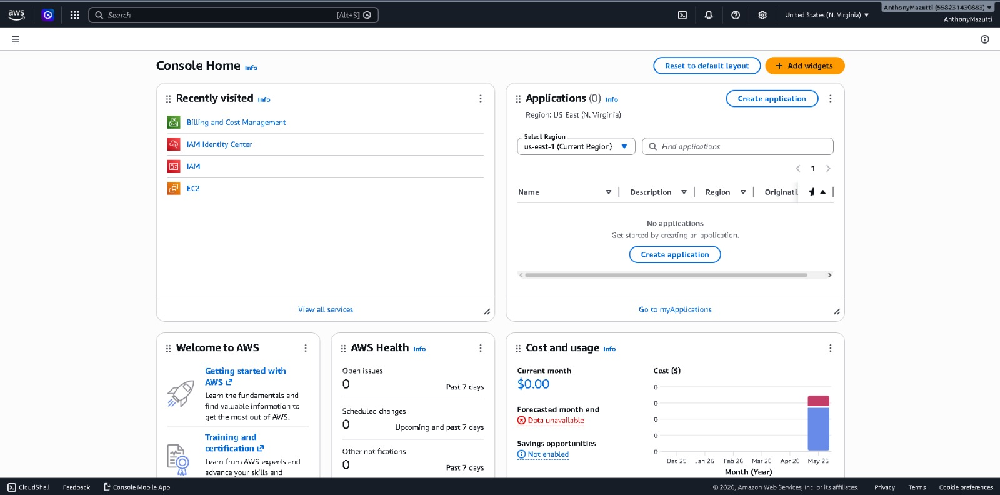
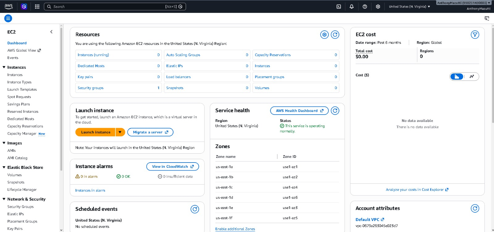
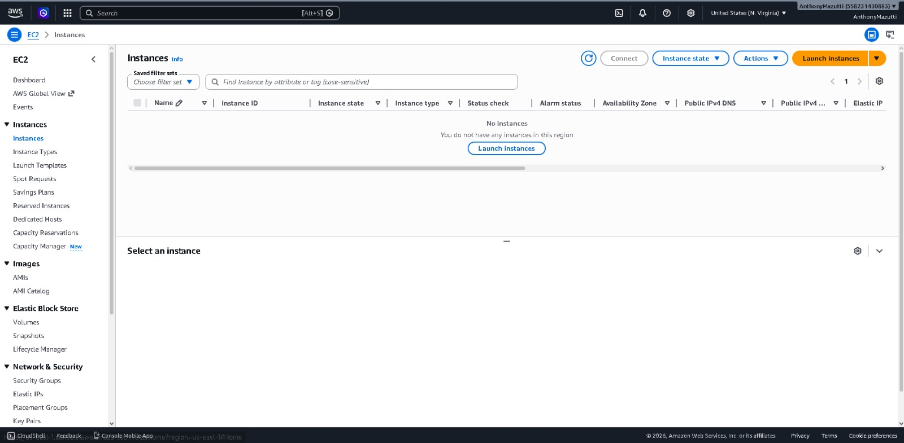
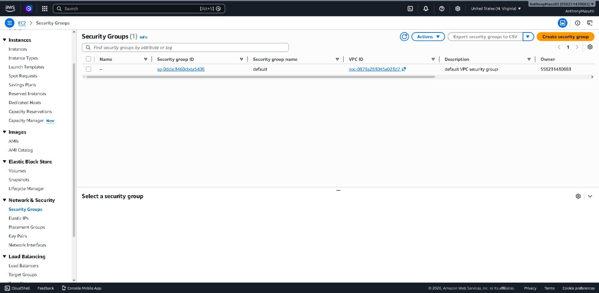

# ☁️ Desafio DIO - Gerenciamento de Instâncias EC2 na AWS

## 📚 Sobre o Projeto

Este projeto foi desenvolvido durante o laboratório da DIO com foco no gerenciamento de instâncias EC2 na AWS.

O objetivo deste desafio foi aplicar conceitos de computação em nuvem na prática, utilizando os principais serviços da AWS, além de documentar toda a experiência técnica utilizando GitHub e Markdown.

---

# 🎯 Objetivos do Laboratório

- Compreender o funcionamento do Amazon EC2
- Criar e gerenciar instâncias na AWS
- Configurar Security Groups
- Aprender conceitos de armazenamento em nuvem
- Utilizar serviços como Amazon EBS e Amazon S3
- Realizar acesso remoto via SSH
- Desenvolver documentação técnica organizada no GitHub

---

# 🚀 O que aprendi

Durante o desenvolvimento deste laboratório aprendi sobre:

- Amazon EC2
- Amazon EBS
- Amazon S3
- Security Groups
- Escalabilidade
- Armazenamento em nuvem
- Gerenciamento de instâncias
- Segurança em ambientes cloud
- Conexão remota via SSH
- Organização de documentação técnica

---

# 💻 Amazon EC2

O Amazon EC2 (Elastic Compute Cloud) permite criar servidores virtuais na nuvem de forma prática e escalável.

Com ele é possível:

- Criar máquinas virtuais
- Hospedar aplicações
- Gerenciar recursos computacionais
- Configurar segurança
- Escalar aplicações conforme necessidade

Durante o laboratório foi realizada a criação e gerenciamento de instâncias EC2 utilizando a AWS Management Console.

---

# 💾 Amazon EBS

O Amazon EBS (Elastic Block Store) é utilizado para armazenamento persistente das instâncias EC2.

Aprendizados obtidos:

- Criação de volumes
- Persistência de dados
- Expansão de armazenamento
- Criação de snapshots
- Associação de volumes às instâncias

---

# 📦 Amazon S3

O Amazon S3 (Simple Storage Service) é um serviço de armazenamento de objetos da AWS.

Recursos estudados:

- Upload de arquivos
- Organização de buckets
- Armazenamento em nuvem
- Gerenciamento de arquivos
- Versionamento de objetos

---

# 🔐 Security Groups

Os Security Groups funcionam como firewall virtual da AWS, controlando o tráfego de entrada e saída das instâncias.

Durante o laboratório foi possível aprender:

- Liberação de portas
- Configuração de regras
- Controle de acesso
- Segurança de instâncias EC2
- Permissões para SSH e HTTP

---

# ⚙️ Etapas Realizadas

## 1. Criação da Instância EC2

Foram realizadas as seguintes etapas:

- Acesso ao painel AWS
- Seleção do serviço EC2
- Escolha da AMI Amazon Linux
- Escolha do tipo de instância `t2.micro`
- Configuração da chave SSH
- Inicialização da instância

---

## 2. Configuração do Security Group

Configuração das portas:

| Porta | Protocolo | Finalidade |
|------|------|------|
| 22 | SSH | Acesso remoto |
| 80 | HTTP | Aplicações web |

---

## 3. Conexão SSH

Comando utilizado para conexão remota:

```bash
ssh -i chave.pem ec2-user@IP-DA-INSTANCIA
```

---

# 📸 Capturas de Tela

As imagens utilizadas no laboratório estão organizadas na pasta `/images`.

---

## Dashboard AWS



---

## Amazon EC2



---

## Instâncias EC2



---

## Security Groups




# 📖 Aprendizados Obtidos

Este laboratório permitiu compreender na prática:

- Conceitos fundamentais de cloud computing
- Funcionamento dos serviços AWS
- Gerenciamento de servidores virtuais
- Segurança em ambientes cloud
- Organização de documentação técnica
- Utilização do GitHub como ferramenta profissional

---

# ⚠️ Dificuldades Encontradas

Algumas dificuldades enfrentadas durante o laboratório:

- Configuração correta do Security Group
- Entendimento das permissões da chave `.pem`
- Primeira conexão SSH na instância EC2
- Navegação inicial na plataforma AWS

Esses desafios contribuíram para um aprendizado mais completo da plataforma.

---

# 🛠️ Tecnologias Utilizadas

- AWS
- Amazon EC2
- Amazon EBS
- Amazon S3
- Git
- GitHub
- Markdown
- Linux

---

# 📂 Estrutura do Repositório

```txt
aws-ec2-lab/
│
├── README.md
│
└── images/
    ├── dashboard-aws.png
    ├── ec2-dashboard.png
    ├── instancias-ec2.png
    ├── security-groups.png
    ├── s3-dashboard.png
    └── instancia-rodando.png
```

---

# 🎯 Conclusão

Este laboratório foi essencial para compreender na prática o funcionamento dos principais serviços da AWS, especialmente o Amazon EC2 e seus recursos de gerenciamento.

Além do aprendizado técnico, o desafio também contribuiu para o desenvolvimento de habilidades em documentação técnica, organização de projetos e utilização do GitHub como ferramenta profissional.

---

# 👨‍💻 Autor

Desenvolvido por Anthony Mazutti durante o laboratório da DIO.
